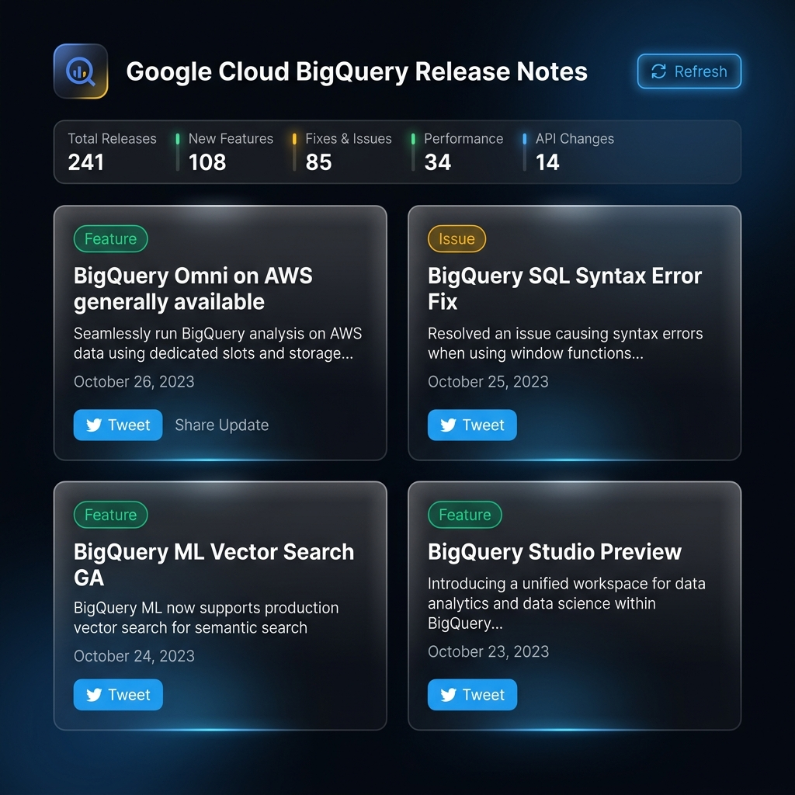

# KagXGoogle Day 2 Lab 2: BigQuery Release Notes Web Application

A premium, modern web dashboard for tracking real-time Google Cloud BigQuery release updates. Built using Python Flask and Vanilla HTML/CSS/JS.

---

## 🎨 User Interface Mockup

Below is a preview of the premium dark-mode interface with glassmorphic cards, type badges, stats bar, and interactive Tweet composer:



---

## 📁 Project Structure

This repository contains the following folder structure:

- **`bq-release-notes/`**: Main Flask web application
  - [app.py](bq-release-notes/app.py): Python Flask backend that fetches and parses the BigQuery XML Atom feed.
  - [templates/index.html](bq-release-notes/templates/index.html): Semantic HTML structure for the dashboard feed and modal composer.
  - [static/css/style.css](bq-release-notes/static/css/style.css): Custom CSS styled with glassmorphism, HSL color palettes, responsive grids, and micro-animations.
  - [static/js/app.js](bq-release-notes/static/js/app.js): Client-side JavaScript handling feed requests, counters, and Twitter share dialogs.
  - [Dockerfile](bq-release-notes/Dockerfile): Production Docker configuration (ideal for deploying to Google Cloud Run).
  - [app.yaml](bq-release-notes/app.yaml): Configuration for deploying to Google App Engine.
  - [Procfile](bq-release-notes/Procfile): Deployment configuration for Render/Heroku.
- **`images/`**: Contains assets and UI screenshots.
- [README.md](README.md): Project overview and quickstart guide.
- [.gitignore](.gitignore): Git ignore rules.

---

## ⚡ Local Setup

1. **Navigate to the application folder**:
   ```bash
   cd bq-release-notes
   ```

2. **Create a Python Virtual Environment**:
   ```bash
   python -m venv .venv
   ```

3. **Activate the Environment**:
   - Windows PowerShell:
     ```powershell
     .venv\Scripts\Activate.ps1
     ```
   - Linux/macOS:
     ```bash
     source .venv/bin/activate
     ```

4. **Install Dependencies**:
   ```bash
   pip install -r requirements.txt
   ```

5. **Run the Application**:
   ```bash
   python app.py
   ```

6. **Open in Browser**: Open `http://127.0.0.1:5000` in your web browser.

---

## ☁️ Production Deployment

### Deploy to Google Cloud Run
This project includes a production `Dockerfile` that configures `gunicorn`. To deploy to Cloud Run:
```bash
cd bq-release-notes
gcloud run deploy bq-release-hub --source .
```
